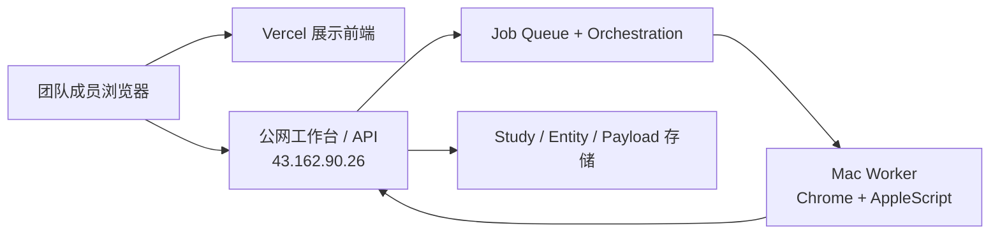

# Demand Intelligence Platform

## 技术系统设计文档

日期：2026-03-21  
版本：v1.0

---

## 1. 技术目标

本系统的技术设计目标不是做一个“全自动云端爬虫平台”，而是先稳定交付一套：

- 团队可访问
- 可持续刷新
- 评论驱动
- 可观察
- 可停止
- 可重试

的需求情报系统。

---

## 2. 当前部署架构

---

## 3. 主要组件

### 3.1 前端

文件：

- [docs/product/index.html](/Users/perrilee/Desktop/探索/raddit/docs/product/index.html)
- [docs/product/mvp-app.html](/Users/perrilee/Desktop/探索/raddit/docs/product/mvp-app.html)
- [docs/product/mvp-app.js](/Users/perrilee/Desktop/探索/raddit/docs/product/mvp-app.js)
- [docs/product/prototype.css](/Users/perrilee/Desktop/探索/raddit/docs/product/prototype.css)

职责：

- 展示 Dashboard / Operations / Study Setup / Weekly Brief
- 调 API
- 渲染 Worker 状态与异常
- 提供停止任务、重试任务等交互

### 3.2 后端 API

文件：

- [scripts/demand_intelligence_server.py](/Users/perrilee/Desktop/探索/raddit/scripts/demand_intelligence_server.py)

职责：

- 认证
- Study 管理
- 调度与队列
- runtime summary
- worker claim/complete/fail
- 构建与发布 payload

### 3.3 Mac Worker

文件：

- [scripts/mac_worker_agent.py](/Users/perrilee/Desktop/探索/raddit/scripts/mac_worker_agent.py)

职责：

- 轮询远程任务
- 认领 `discover / harvest / refresh_hot`
- 调 Chrome + AppleScript 执行浏览器采集
- 回传结果
- 响应取消指令

### 3.4 Pipeline / Data Builders

- [scripts/discover_threads.py](/Users/perrilee/Desktop/探索/raddit/scripts/discover_threads.py)
- [scripts/harvest_threads.py](/Users/perrilee/Desktop/探索/raddit/scripts/harvest_threads.py)
- [scripts/refresh_hot_threads.py](/Users/perrilee/Desktop/探索/raddit/scripts/refresh_hot_threads.py)
- [scripts/build_study_entity_store.py](/Users/perrilee/Desktop/探索/raddit/scripts/build_study_entity_store.py)
- [scripts/build_demand_intelligence_payload.py](/Users/perrilee/Desktop/探索/raddit/scripts/build_demand_intelligence_payload.py)

---

## 4. 数据模型

### 4.1 Study 级

- `data/studies/*.json`
- `config/studies/*.json`

### 4.2 Entity 级

- `manifest.json`
- `threads.json`
- `thread_snapshots.json`
- `comments.json`
- `comment_snapshots.json`
- `signals.json`

### 4.3 前端发布级

- `docs/product/data/studies/*-payload.json`
- `docs/product/data/studies/*-payload.js`

### 4.4 Job 级

- `data/jobs/*.json`

每个 job 具备：

- mode
- stage_kind
- stage_label
- queue_lane
- priority_score
- status
- claimed_by_worker_id
- result_summary

---

## 5. Orchestration 设计

### 5.1 模式

- seeded
- browser
- hot_threads
- adaptive

### 5.2 pipeline stage

- discover
- harvest
- refresh_hot
- rebuild_aggregates
- publish_brief

### 5.3 queue lane

- realtime
- discovery
- maintenance

### 5.4 adaptive 目标

根据当前 Study 的评论覆盖率、新鲜度、热点线程状态，自动决定跑：

- hot_threads
- browser
- seeded

---

## 6. 停止与取消机制

### 6.1 为什么要有 stop

因为浏览器抓取运行在办公 Mac 上，会直接影响日常办公。

### 6.2 当前实现

- 前端：Study 级 stop 按钮
- 后端：`POST /api/studies/:id/stop`
- job 状态：`queued/running -> canceling/canceled`
- Worker：轮询 job 状态，发现 `canceling` 时终止子进程

相关文件：

- [docs/product/mvp-app.js](/Users/perrilee/Desktop/探索/raddit/docs/product/mvp-app.js)
- [scripts/demand_intelligence_server.py](/Users/perrilee/Desktop/探索/raddit/scripts/demand_intelligence_server.py)
- [scripts/mac_worker_agent.py](/Users/perrilee/Desktop/探索/raddit/scripts/mac_worker_agent.py)

---

## 7. 运维能力

### 已有

- health endpoint
- runtime alerts
- worker online/offline/stale
- failed job retry
- stop crawl
- launch agent status scripts

### 文件

- [scripts/status_launch_agent.sh](/Users/perrilee/Desktop/探索/raddit/scripts/status_launch_agent.sh)
- [scripts/status_mac_worker_launch_agent.sh](/Users/perrilee/Desktop/探索/raddit/scripts/status_mac_worker_launch_agent.sh)

---

## 8. 当前技术边界

### 8.1 非完全云端

当前 Reddit 浏览器抓取仍依赖：

- Chrome
- AppleScript
- 登录态 macOS 会话

因此仍然需要 Mac Worker。

### 8.2 公网 API 仍为 HTTP

当前团队可用地址是：

- [`http://43.162.90.26/`](http://43.162.90.26/)

这意味着：

- Vercel 展示站更适合作为演示
- 真正交互以公网工作台为主

### 8.3 文件型状态存储

当前 jobs/studies/entities 仍主要落文件。

后续建议：

- Postgres
- Redis / 任务队列
- 对象存储

---

## 9. 后续技术演进建议

1. 给公网 API 上 HTTPS 与正式域名
2. Worker token 和用户认证做更正式的安全管理
3. 用数据库替代文件型作业状态
4. 把部分抓取链路迁到 Playwright/Linux
5. 增加更强的日志、trace 与告警

---

## 10. 参考技术文档

- [生产级数据架构方案](/Users/perrilee/Desktop/探索/raddit/docs/product/2026-03-19-demand-intelligence-production-data-architecture.md)
- [重构路线图](/Users/perrilee/Desktop/探索/raddit/docs/product/2026-03-19-demand-intelligence-rebuild-roadmap.md)
- [混合部署实施方案](/Users/perrilee/Desktop/探索/raddit/docs/product/2026-03-20-solution-a-hybrid-deployment-implementation-plan.md)
