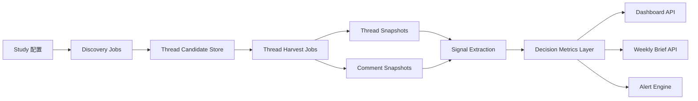

# Demand Intelligence Platform

## 生产级数据架构方案

日期：2026-03-19  
适用范围：Reddit 为首个数据源、浏览器采集为主链路、面向 CEO 与业务线负责人做客群与产品包装决策

## 一句话结论

当前系统已经具备了 `Study -> 采样 -> 聚合 -> Dashboard` 的产品雏形，但还没有跨过商业可用门槛。

最核心的缺口不是前端，而是数据层：

- 现在更像 `静态样本分析机`，不是 `持续刷新情报系统`
- 现在更像 `帖子层分类器`，不是 `thread + 评论层语义引擎`
- 现在可以支持“看一次”，还不支持“每天看、持续看、看变化”

如果 Reddit 官方商业接入路径暂时不可用，生产版就必须围绕 `浏览器发现 + thread 级增量刷新 + 评论语义抽取 + 决策新鲜度标记` 来重构。

---

## 1. 为什么当前版本还不具备商业价值

### 1.1 当前系统真实能力

当前仓库已经做到了：

- 用浏览器和 OAuth 两种方式抓 Reddit 帖子
- 把帖子归类为客群、痛点、推荐产品
- 生成 Dashboard、Weekly Brief、Packaging Studio
- 做定时调度、任务队列和 Study 管理

这说明产品外壳和决策展示层已经成型。

### 1.2 当前系统关键缺口

关键缺口同样已经在代码里被确认。

#### 缺口 A：浏览器采集只抓搜索结果卡片，不抓 thread 评论

当前浏览器管线在搜索结果页提取的是：

- `title`
- 搜索结果卡片里的 `body` 片段
- `score`
- `num_comments`
- `url`

没有进入帖子详情页抓评论，`author` 也是空值。

证据：
[reddit_browser_pipeline.py](/Users/perrilee/Desktop/探索/raddit/scripts/reddit_browser_pipeline.py#L257)
[reddit_browser_pipeline.py](/Users/perrilee/Desktop/探索/raddit/scripts/reddit_browser_pipeline.py#L292)

#### 缺口 B：当前语义层只使用 `title + body`

目前 `content_text()` 只把 `title + body` 拼接起来，后续的：

- urgency
- specificity
- pain classification
- segment classification

都建立在这段文本上。

证据：
[build_demand_intelligence_payload.py](/Users/perrilee/Desktop/探索/raddit/scripts/build_demand_intelligence_payload.py#L232)
[build_demand_intelligence_payload.py](/Users/perrilee/Desktop/探索/raddit/scripts/build_demand_intelligence_payload.py#L256)

#### 缺口 C：当前调度器不等于实时刷新

现在的调度器确实存在，但本质是：

- 定时触发 job
- browser 模式重新跑一次采样
- 或 seeded 模式重新 materialize 旧数据

这还不是 `增量刷新线程`，也不是 `持续跟踪热点 thread`。

证据：
[run_study_pipeline.py](/Users/perrilee/Desktop/探索/raddit/scripts/run_study_pipeline.py#L23)
[demand_intelligence_server.py](/Users/perrilee/Desktop/探索/raddit/scripts/demand_intelligence_server.py#L445)
[demand_intelligence_server.py](/Users/perrilee/Desktop/探索/raddit/scripts/demand_intelligence_server.py#L489)

#### 缺口 D：趋势层允许使用样本顺序近似时间窗口

当前趋势生成逻辑会在时间戳不足时退化成按样本顺序分桶。

这在 demo 可接受，但在 CEO 级决策系统里会削弱可信度。

证据：
[build_demand_intelligence_payload.py](/Users/perrilee/Desktop/探索/raddit/scripts/build_demand_intelligence_payload.py#L411)
[build_demand_intelligence_payload.py](/Users/perrilee/Desktop/探索/raddit/scripts/build_demand_intelligence_payload.py#L494)

### 1.3 为什么 CEO 不会长期使用当前版本

CEO 和业务负责人真正关心的是：

- 这个机会是不是最近刚升温
- 评论区是在确认这个痛点，还是在反驳它
- 用户是不是已经在找解决方案
- 市场推荐的方案、竞品、替代路径是什么
- 过去 24 小时新出现了哪些 objection

这些信息很多并不在标题里，而在评论里。

所以当前版本最多支持：

- 一次性探索
- 初步包装验证
- 演示型 dashboard

还不能支撑：

- 高频周会决策
- 趋势预警
- 持续产品定位迭代
- 面向外部客户的可收费情报服务

---

## 2. 产品级设计原则

如果浏览器采集是主链路，产品设计必须遵守这 6 条原则。

### 2.1 决策新鲜度优先于样本规模

对业务负责人来说：

- 300 条昨天的帖子

不如

- 50 条最近 24 小时、评论充分展开、能解释变化的 thread

### 2.2 thread 是主对象，不是 post

生产系统里的核心对象必须从 `post` 升级为 `thread`。

一个 thread 至少包含：

- 主帖内容
- 评论层
- 快照历史
- 热度变化
- 推荐方案和反对意见

### 2.3 评论是一等公民

没有评论，系统只能回答“大家在说什么”。

有评论，系统才能回答：

- 大家为什么这么说
- 大家是否认同
- 大家推荐什么方案
- 大家最担心什么

### 2.4 增量刷新优先于全量重跑

产品必须知道：

- 哪些新帖子值得抓
- 哪些老帖子值得继续跟踪
- 哪些帖子已经进入冷却期

而不是每次从头跑一遍关键词搜索。

### 2.5 结论必须带新鲜度和覆盖率

每条结论卡必须能回答：

- 最后刷新时间
- 评论覆盖率
- 当前置信度
- 结论主要来自标题、正文还是评论

### 2.6 浏览器链路只能支撑“半自动高频情报系统”

如果主链路只能是浏览器采集，这个产品应先定位为：

- 内部情报工作台
- 或专家辅助型策略服务平台

而不是多租户、开放式、强实时 SaaS。

---

## 3. 目标架构总览

### 3.1 四层模型

#### 第一层：Discovery Layer

负责发现新的候选 thread。

输入：

- subreddit
- keyword group
- time window

输出：

- 新 thread URL
- 初始帖子元数据
- 是否进入跟踪池

#### 第二层：Thread Harvest Layer

负责进入具体帖子详情页抓完整 thread。

输出：

- 主帖全文
- top comments
- replies
- 作者 / OP 回复
- 评论展开状态

#### 第三层：Semantic Layer

负责把帖子与评论翻译成结构化信号。

输出：

- pain
- buying stage
- solution mentions
- objections
- confirmation / contradiction

#### 第四层：Decision Layer

负责面向负责人输出：

- 高价值客群
- 推荐产品包装
- 趋势变化
- 新鲜度
- 预警

---

## 4. 数据模型

生产版不应该继续只依赖单个 JSONL。  
第一阶段可以继续用文件存储，但结构上必须按以下实体组织。

## 4.1 `studies`

研究任务本体。

建议字段：

- `id`
- `title`
- `market`
- `business_line`
- `region`
- `target_customer`
- `primary_goal`
- `problem_space`
- `source_strategy`
- `status`
- `created_at`
- `updated_at`

## 4.2 `source_queries`

记录每个 study 的采集配置。

建议字段：

- `id`
- `study_id`
- `source_type` (`reddit_browser`)
- `subreddit`
- `query_group`
- `query_text`
- `sort`
- `time_filter`
- `enabled`
- `priority`

## 4.3 `threads`

候选 thread 主表。

建议字段：

- `thread_id`
- `study_id`
- `source_platform`
- `subreddit`
- `title`
- `url`
- `author`
- `created_at`
- `current_score`
- `current_comment_count`
- `status` (`new / tracked / cooling / archived / failed`)
- `first_seen_at`
- `last_seen_at`
- `last_harvest_at`
- `tracking_priority`

## 4.4 `thread_snapshots`

用于保留 thread 在不同时间点的状态。

建议字段：

- `snapshot_id`
- `thread_id`
- `captured_at`
- `title`
- `body`
- `score`
- `comment_count`
- `op_reply_count`
- `locked`
- `removed`
- `deleted`
- `page_hash`
- `selector_version`

说明：

- 这张表是趋势与变更检测的基础
- 主帖内容更新、评论增长、状态变化都靠它追踪

## 4.5 `comments`

评论主表。

建议字段：

- `comment_id`
- `thread_id`
- `parent_id`
- `author`
- `depth`
- `permalink`
- `first_seen_at`
- `last_seen_at`
- `status`

## 4.6 `comment_snapshots`

评论快照表。

建议字段：

- `snapshot_id`
- `comment_id`
- `captured_at`
- `body`
- `score`
- `is_op_reply`
- `awards_count`
- `selector_version`

说明：

- 评论语义要基于这张表做
- 回复内容的变化、删除、补充都能保留

## 4.7 `signals`

语义抽取后的结构化信号表。

建议字段：

- `signal_id`
- `study_id`
- `thread_id`
- `comment_id` nullable
- `source_level` (`thread / comment`)
- `pain_category`
- `problem_context`
- `decision_stage`
- `buying_signal`
- `signal_type`
- `solution_mention`
- `competitor_mention`
- `objection_type`
- `stance` (`confirm / contradict / enrich / recommend`)
- `confidence`
- `captured_at`

## 4.8 `aggregates`

Dashboard 和周报的预聚合层。

建议字段：

- `study_id`
- `bucket_key`
- `metric_name`
- `metric_value`
- `refreshed_at`

例子：

- `fresh_threads_24h`
- `comment_confirmation_score`
- `solution_density`
- `objection_density`
- `segment_opportunity_score`
- `packaging_readiness_score`

## 4.9 `alerts`

用于记录需要主动推送的变化。

建议字段：

- `alert_id`
- `study_id`
- `type`
- `severity`
- `title`
- `body`
- `evidence_refs`
- `status`
- `created_at`

---

## 5. 任务系统与刷新策略

生产版必须从“全量重跑”转成“多种 job 协同”。

## 5.1 Job 类型

### `discover_threads`

作用：

- 跑 subreddit + keyword
- 发现新的候选 thread

频率建议：

- 每 30-60 分钟

输出：

- 新 thread
- 已存在 thread 的最新统计

### `harvest_thread`

作用：

- 进入具体 thread 页面
- 抓主帖 + 评论 + 回复

触发条件：

- 新 thread
- 热门 thread 达到刷新阈值
- 评论增长过快

### `refresh_hot_threads`

作用：

- 专门刷新高价值 thread

优先对象：

- 高评论数
- 高 buying signal
- 与当前主假设高度相关

### `extract_signals`

作用：

- 对新 thread snapshot 和 comment snapshot 抽语义

### `rebuild_aggregates`

作用：

- 只重算受影响的指标
- 不全量 materialize

### `publish_brief`

作用：

- 每日简报
- 每周策略简报
- 异常预警摘要

## 5.2 推荐刷新 SLA

### 新发现的高价值 thread

- 首次发现后 0-6 小时：每 15-30 分钟刷新
- 6-48 小时：每 1 小时刷新
- 2-7 天：每天 1 次
- 超过 7 天：转入冷却

### 普通 thread

- 首次抓取
- 6-12 小时后补抓一次
- 然后停止高频刷新

### Dashboard 聚合

- 每 1 小时增量刷新一次

### 周报

- 每天生成 daily summary
- 每周生成 weekly brief

---

## 6. 浏览器主链路下的特殊设计

如果浏览器采集是主链路，系统需要做生产级适配，而不是继续把它当验证脚本。

## 6.1 浏览器只负责两件事

### Discovery

- 搜索结果页
- subreddit 列表页

### Harvest

- 进入 thread 页面抓完整主帖和评论

不要再把搜索结果卡片本身当最终分析对象。

## 6.2 选择器版本化

必须增加：

- `selector_version`
- `page_hash`
- `harvest_error_type`

这样一旦 Reddit DOM 改版，可以快速判断：

- 是页面变了
- 是 block 了
- 还是评论展开逻辑坏了

## 6.3 评论采集的最小标准

每个高价值 thread 至少抓：

- 主帖全文
- 前 30-100 条评论
- OP 回复
- 高赞评论
- 回复树前两层

如果性能有限，宁可减少 thread 数，也要提升 thread 深度。

## 6.4 浏览器链路的稳定性要求

需要新增：

- block page detection
- retry with backoff
- partial harvest success
- comment expansion timeout handling
- screenshot on failure
- raw HTML snapshot on failure

## 6.5 生产定位建议

浏览器主链路下，不建议第一阶段就对外卖自助 SaaS。

建议优先定位为：

- 内部需求情报工作台
- 或顾问/研究服务的底层系统

---

## 7. 语义层升级方案

当前系统只识别 `pain` 还不够。  
决策产品必须从评论层抽出真正支持包装和销售的话语。

## 7.1 thread 级信号

建议抽取：

- `thread_intent`
  - complaint
  - advice_request
  - vendor_search
  - comparison
  - validation

- `decision_stage`
  - aware
  - comparing
  - replacing
  - actively_buying

- `commercial_value`
  - low / medium / high

## 7.2 comment 级信号

建议抽取：

- `stance`
  - confirm
  - contradict
  - enrich
  - recommend

- `solution_mention`
  - 3PL
  - supplier
  - fulfillment center
  - agent
  - competitor brand

- `objection_type`
  - too_expensive
  - too_slow
  - low_trust
  - poor_quality
  - not_scalable

- `budget_signal`
  - price_sensitive
  - ready_to_pay

- `execution_barrier`
  - no_process
  - no_supplier
  - no_fulfillment_setup
  - coordination_issue

## 7.3 聚合后要形成的新指标

### `comment_confirmation_score`

评论区里“确认主痛点”的比例。

### `solution_density`

评论区里出现解决方案、服务类型、供应商类别的密度。

### `objection_density`

评论区里出现顾虑和反对意见的密度。

### `thread_momentum`

thread 在最近几个刷新窗口中的增长速度。

### `freshness_score`

基于：

- 最近刷新时间
- thread 年龄
- 热门 thread 覆盖率

### `comment_coverage`

基于：

- 实际抓到的评论数量
- 是否覆盖 OP 回复
- 是否覆盖 top comments

---

## 8. Dashboard 必须新增的字段

为了让 CEO 信任结果，首页每个核心模块必须显示数据状态。

## 8.1 Executive Summary 新增

- `Last refreshed`
- `Freshness`
- `Evidence count`
- `Tracked threads`
- `Comment coverage`

## 8.2 Opportunity Cards 新增

- `来自评论确认度`
- `最近 24h 新增 objection`
- `趋势依据是标题、正文还是评论`

## 8.3 Evidence Wall 新增

卡片要区分：

- Thread 原话
- Comment 原话
- OP 后续回复

## 8.4 Weekly Brief 新增

每周简报必须回答：

- 最近 7 天新增了哪些高价值 thread
- 评论里新增了哪些主流方案
- 评论里新增了哪些反对理由
- 哪个产品包装被评论语义进一步验证

---

## 9. API 层目标

现有 API 可以保留壳，但要重构 payload 来源。

建议新增这些接口：

- `GET /api/studies/:id/freshness`
- `GET /api/studies/:id/threads`
- `GET /api/studies/:id/threads/:threadId`
- `GET /api/studies/:id/comments`
- `GET /api/studies/:id/signals`
- `GET /api/studies/:id/alerts`
- `POST /api/studies/:id/discover`
- `POST /api/studies/:id/refresh-hot-threads`

`/dashboard` 保留，但应该来自聚合层，而不是直接从原始帖子 JSONL 现算。

---

## 10. 第一阶段成功标准

如果要判断这次重构是否成功，我建议用下面 8 个标准。

1. 至少支持 `新 thread 发现 + 热门 thread 跟踪`
2. 高价值 thread 的评论能被持续刷新
3. Dashboard 上每个结论都能显示 `last refreshed`
4. Dashboard 上每个结论都能显示 `comment coverage`
5. 评论语义能抽出 `solution_mention` 和 `objection_type`
6. Weekly Brief 能输出“新增 objection”和“新增方案模式”
7. 趋势图不再依赖样本顺序近似
8. 负责人能区分“旧结论”和“最近变化”

---

## 11. 最终建议

如果你们当前拿不到 Reddit 的商业 API 路径，这套产品仍然能做，但路线必须调整。

### 应该接受的现实

- 不要先把它包装成强实时 SaaS
- 不要先做多租户外部产品
- 不要继续只优化前端

### 应该优先投入的地方

- thread 级采集
- 评论级语义
- 增量刷新
- 新鲜度与覆盖率
- 预警和周报

### 应该把它先卖成什么

- 内部情报工作台
- 或咨询/策略服务的底层情报系统

等浏览器链路稳定、决策价值被验证，再决定是否升级为更开放的产品形态。
