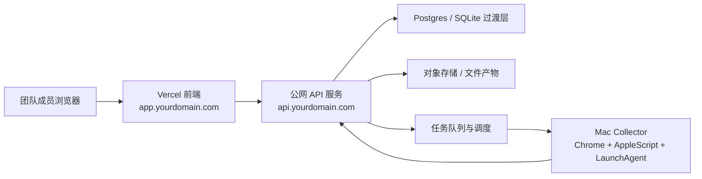

# Demand Intelligence Platform

## 方案 A：混合部署实施方案

日期：2026-03-20  
适用范围：前端继续走 Vercel，后端 API 部署到公网服务器，浏览器采集链路暂时保留在 Mac 采集节点

---

## 一句话结论

方案 A 的目标不是一次性把整套系统“全云化”，而是先让：

- 同事可以通过公网地址使用完整产品界面
- 后端 API、Study、队列、结果聚合可以稳定在线运行
- Reddit 浏览器采集链路仍然跑在一台长期在线的 Mac 上
- Dashboard、Weekly Brief、Operations 读取的是公网后端的实时结果，而不是本机 `127.0.0.1`

这是一条 **最快把当前系统变成团队可用产品** 的路线。

---

## 1. 方案 A 的目标边界

### 1.1 这次要解决什么

当前系统已经具备：

- 可用的前端产品壳
- Study、Schedule、Jobs、Operations
- Reddit 的 thread discovery / harvest / hot-thread refresh
- 本机 LaunchAgent 常驻运行

但它还不能被团队共享使用，因为：

- 前端虽然在线，但真实后端仍是本机 `127.0.0.1:8765`
- 采集、调度、聚合仍依赖你自己的 Mac 运行
- 同事无法直接使用完整系统

### 1.2 这次不解决什么

方案 A 不试图在本阶段解决：

- Linux 上完全替代 Chrome + AppleScript 抓取
- 多租户 SaaS
- 真正的高并发开放式数据平台
- Reddit 商业 API 授权问题

这次的目标是：

**先让“一个团队”能稳定共享使用同一套需求情报系统。**

---

## 2. 推荐部署拓扑

---

## 3. 组件拆分

## 3.1 Vercel 前端

保留当前在线前端：

- [首页](/Users/perrilee/Desktop/探索/raddit/docs/product/index.html)
- [产品演示与应用壳](/Users/perrilee/Desktop/探索/raddit/docs/product/mvp-app.html)
- [前端逻辑](/Users/perrilee/Desktop/探索/raddit/docs/product/mvp-app.js)

职责：

- 用户登录
- Study 创建与编辑
- Dashboard / Weekly Brief / Operations 展示
- 通过 `API_BASE_URL` 请求公网后端

不再承担：

- 本地队列
- 本地 JSON 文件读取
- 本地 localhost 依赖

### 域名建议

- `app.fishgoo.com` 或 `intel.fishgoo.com`

---

## 3.2 公网 API 服务

当前基础服务文件：

- [demand_intelligence_server.py](/Users/perrilee/Desktop/探索/raddit/scripts/demand_intelligence_server.py)

方案 A 中，它需要升级成真正的公网后端，职责包括：

- 用户身份认证
- Study 配置管理
- 调度规则管理
- 作业编排与状态查询
- 聚合产物读取
- 给前端输出统一 API
- 给 Mac Worker 下发任务
- 接收 Worker 回传结果

### 部署建议

- 服务器：Ubuntu 22.04
- 规格：2C4G 起步
- 运行方式：
  - 第一阶段：`gunicorn` / `uvicorn` + `nginx`
  - 第二阶段：Docker Compose

### 域名建议

- `api.fishgoo.com`

---

## 3.3 Mac Collector

当前浏览器采集链路基于：

- [discover_threads.py](/Users/perrilee/Desktop/探索/raddit/scripts/discover_threads.py)
- [harvest_threads.py](/Users/perrilee/Desktop/探索/raddit/scripts/harvest_threads.py)
- [refresh_hot_threads.py](/Users/perrilee/Desktop/探索/raddit/scripts/refresh_hot_threads.py)
- [reddit_browser_common.py](/Users/perrilee/Desktop/探索/raddit/scripts/reddit_browser_common.py)

它们依赖：

- `Google Chrome`
- `osascript`
- Apple Events
- 有桌面会话的 macOS 环境

因此方案 A 中，采集器不迁云，先保留为 **独立 Mac Worker**。

### 推荐形态

- 一台专门在线的 Mac mini 或长期在线办公 Mac
- 独立运行：
  - LaunchAgent
  - Chrome
  - Worker 轮询程序

### Worker 角色

- 拉取 `discover / harvest / refresh_hot` 类任务
- 本地执行浏览器抓取
- 将结果上传到公网后端
- 不承担前端展示

---

## 4. 方案 A 的数据流

## 4.1 Study 创建

1. 用户在前端填写：
   - 市场
   - 客群
   - 问题方向
2. 前端请求公网 API：
   - 生成推荐关键词和 subreddit
3. 用户确认后保存 Study
4. 后端自动：
   - 生成 study config
   - 写入数据库
   - 触发首次 `browser/discover` 任务

## 4.2 采集链路

1. API 把任务写入队列
2. Mac Worker 轮询取任务
3. Worker 执行：
   - `discover`
   - `harvest`
   - `refresh_hot`
4. Worker 回传：
   - thread 数据
   - comments
   - snapshots
   - 执行日志

## 4.3 聚合链路

API 收到原始结果后继续触发：

- `rebuild_aggregates`
- `publish_brief`

产出：

- Dashboard payload
- Weekly Brief
- Operations 统计
- 实体底座更新

## 4.4 前端读取链路

前端统一从公网 API 拉：

- study list
- dashboard
- segments
- operations
- weekly brief
- data foundation

---

## 5. 目标系统分层

## 5.1 前端层

保留并增强：

- `docs/product/index.html`
- `docs/product/mvp-app.html`
- `docs/product/mvp-app.js`

改造点：

1. 增加环境配置
   - `window.__API_BASE_URL__`
2. 所有 API 请求统一走公网域名
3. 登录态改成后端颁发 cookie / token

## 5.2 API 层

建议新增服务模块：

- `auth`
- `studies`
- `jobs`
- `worker`
- `aggregates`
- `publications`

### 核心接口建议

#### 给前端

- `POST /api/auth/login`
- `GET /api/auth/me`
- `GET /api/studies`
- `POST /api/studies/draft`
- `POST /api/studies`
- `GET /api/studies/:id/dashboard`
- `GET /api/studies/:id/weekly-brief`
- `GET /api/studies/:id/operations`
- `POST /api/studies/:id/schedule`

#### 给 Worker

- `POST /api/worker/auth/login`
- `GET /api/worker/jobs/next`
- `POST /api/worker/jobs/:jobId/heartbeat`
- `POST /api/worker/jobs/:jobId/result`
- `POST /api/worker/jobs/:jobId/fail`

## 5.3 存储层

### 第一阶段建议

- `Postgres`
  - study
  - jobs
  - schedules
  - manifests
  - aggregates metadata
- 本地文件或对象存储
  - raw captures
  - entity snapshots
  - payloads

### 第二阶段建议

- `Postgres + S3 compatible object storage`

---

## 6. 当前仓库如何改造

## 6.1 保留

- [demand_intelligence_server.py](/Users/perrilee/Desktop/探索/raddit/scripts/demand_intelligence_server.py)
- [run_study_pipeline.py](/Users/perrilee/Desktop/探索/raddit/scripts/run_study_pipeline.py)
- [build_demand_intelligence_payload.py](/Users/perrilee/Desktop/探索/raddit/scripts/build_demand_intelligence_payload.py)
- [build_study_entity_store.py](/Users/perrilee/Desktop/探索/raddit/scripts/build_study_entity_store.py)
- 所有前端页面与样式

## 6.2 拆分

### 从 `demand_intelligence_server.py` 拆出

1. `api/app.py`
   - 路由入口
2. `api/auth.py`
3. `api/studies.py`
4. `api/jobs.py`
5. `api/worker.py`
6. `services/orchestrator.py`
7. `services/aggregates.py`
8. `services/storage.py`

### 从当前本地 worker 逻辑拆出

1. `worker/collector.py`
2. `worker/executor.py`
3. `worker/result_uploader.py`

## 6.3 废弃思路

不再把以下模式视为“团队共享系统”的主运行方式：

- 让同事访问 `127.0.0.1`
- 让前端直接依赖本地 JSON 文件
- 让单一 Mac 同时承担前端、API、队列和抓取

---

## 7. 交付分期

## Phase A1：公网 API 最小上线

时间：3-5 天

目标：

- 前端不再请求 localhost
- 公网 API 可读 study / dashboard / weekly brief

要做：

1. 把现有后端服务部署到 Ubuntu
2. 配置 `nginx + systemd`
3. 给前端加 `API_BASE_URL`
4. 把 Vercel 指向公网 API

验收：

- 同事可以登录
- 同事能打开 Dashboard
- 不需要访问你的本机 localhost

## Phase A2：Mac Worker 联通

时间：4-6 天

目标：

- 公网 API 能给 Mac 发任务
- Mac 能回传 discover/harvest 结果

要做：

1. 定义 Worker API
2. 把当前本地浏览器脚本包装成远程 worker
3. 增加 `job heartbeat / fail / result`
4. 增加 worker token

验收：

- API 可看到 Worker 在线状态
- 一个 `browser` 任务能完整跑完并回传

## Phase A3：聚合与发布闭环

时间：3-4 天

目标：

- Worker 回传后，Dashboard 自动更新

要做：

1. API 收到结果后触发：
   - `rebuild_aggregates`
   - `publish_brief`
2. 产出写回统一存储
3. 前端读最新 payload

验收：

- 新 thread 进入系统后，Dashboard 变化可见
- Weekly Brief 自动刷新

## Phase A4：调度与运维

时间：3-4 天

目标：

- 系统从“手动触发”升级成“半自动持续运行”

要做：

1. API 端 scheduler
2. Worker 心跳监控
3. 失败重试
4. 任务超时
5. stale 标记

验收：

- 24 小时内自动完成多轮 discover/hot-thread refresh
- 失败任务可定位和重试

---

## 8. 基础设施建议

## 8.1 云端

### 服务器

- Ubuntu 22.04
- 2C4G
- 80 / 443 开放

### 软件

- Python 3.11
- `nginx`
- `systemd`
- `Postgres 15`

### 域名

- `app.fishgoo.com` -> Vercel
- `api.fishgoo.com` -> 云服务器

## 8.2 Mac 节点

要求：

- 长期开机
- 保持登录
- Chrome 可访问 Reddit
- 已开启 `Allow JavaScript from Apple Events`
- 不自动睡眠

建议：

- 专用 Mac mini
- 独立 Chrome Profile

---

## 9. 安全与权限

## 9.1 前端用户

角色建议：

- `viewer`
- `analyst`
- `admin`

## 9.2 Worker 认证

Worker 不应复用普通用户登录。

建议：

- 独立 `worker token`
- 每台 Worker 一个 ID
- 所有回传带：
  - worker id
  - hostname
  - last heartbeat

## 9.3 网络安全

建议：

- API 全站 HTTPS
- 前端只访问 `api.fishgoo.com`
- Worker 回传必须鉴权
- Worker 只需出网，不需要暴露入站端口

---

## 10. 成功标准

方案 A 上线成功，不看“代码是否跑起来”，而看这 6 条：

1. 同事能从公网地址登录系统
2. 不需要访问你的本机 `127.0.0.1`
3. 新建 Study 后能自动触发首次发现
4. Mac Worker 能稳定执行 `discover / harvest / refresh_hot`
5. Dashboard 会因新结果自动更新
6. Weekly Brief 能反映最近 24h / 7d 的变化

---

## 11. 风险与缓解

## 风险 A：Mac 节点掉线

影响：

- 无法继续 discover / harvest

缓解：

- 单独的 Mac mini
- Worker 心跳告警
- API 上显示 worker offline

## 风险 B：Reddit 页面结构变化

影响：

- discover / harvest 失败

缓解：

- HTML 快照
- selector version
- 失败截图
- 热点任务优先级降级

## 风险 C：浏览器链路吞吐有限

影响：

- 多 study 时刷新速度变慢

缓解：

- discovery / hot_threads 分离
- 只刷新高价值 thread
- 先服务少量核心 study

## 风险 D：前后端状态不一致

影响：

- 前端看到旧结果

缓解：

- publication version
- payload build timestamp
- UI 显示 `last refresh / freshness score`

---

## 12. 推荐实施顺序

如果现在立刻开做，我建议按这个顺序推进：

1. 先做 `A1`
   - 把 API 云化
2. 再做 `A2`
   - 把 Mac 抓取器变成远程 Worker
3. 再做 `A3`
   - 接通聚合与发布
4. 最后做 `A4`
   - 做调度、重试、告警

不要反过来。

最先需要解决的是：

**同事能否访问统一的公网 API。**

---

## 13. 我对当前仓库的明确建议

基于当前代码基础，方案 A 是最合适的路线，因为：

- 前端已经在线
- Study / Jobs / Schedule / Operations 已经成型
- Mac 本机采集链路已经可用
- 现在最缺的是“共享访问”和“远程执行分工”

因此：

**不建议现在就全盘重写抓取器。**

应该先把：

- 前端
- API
- Worker

三者拆开，让团队先用起来。

等团队真的持续使用后，再进入下一阶段：

- Linux headless worker
- 全云化
- 更强多租户与更高频刷新

