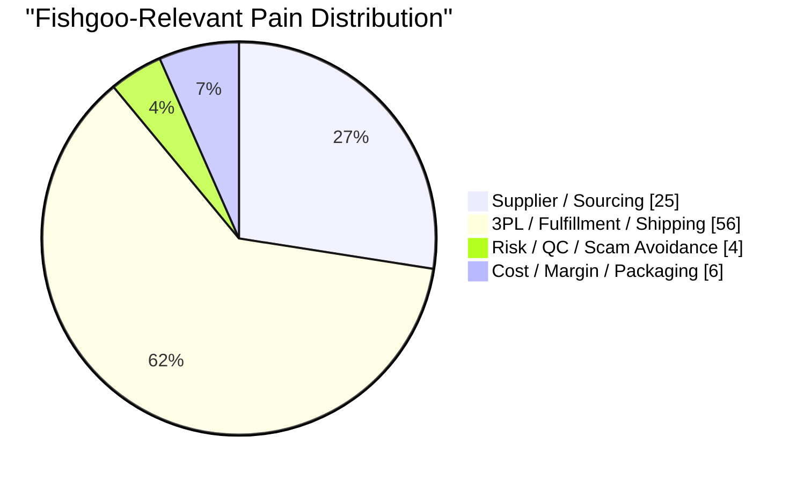

# Fishgoo Visual Strategy Report

- Generated: 2026-03-17 06:20 UTC
- Input: `/Users/perrilee/raddit/data/raw/2026-03-17_045858_reddit_browser_posts.jsonl`
- Focus Subreddits: `dropship, dropshipping`
- Sample Size: `309`
- Current Top Opportunity: `3PL / Fulfillment / Shipping`

## Dashboard Structure

建议把 dashboard 做成 4 个区块：

1. `Top KPI`
- Total posts
- High-urgency posts
- Top pain category
- Highest-priority opportunity

2. `Pain Distribution`
- 条形图: 4 类 Fishgoo 相关痛点帖子量
- 饼图: 高紧急度帖子在 4 类机会中的占比

3. `Pain x Segment Matrix`
- 行: 客群阶段
- 列: 痛点类型
- 颜色深浅: 帖子量 / 高意向数量

4. `Opportunity Decision`
- 气泡图 / 象限图: Fishgoo Fit vs Market Evidence
- 卡片墙: 每类机会最值得看的 3-5 条帖子


## Pain Distribution



| Pain | Posts | Bar |
|---|---:|---|
| 3PL / Fulfillment / Shipping | 56 | ██████████████████ |
| Supplier / Sourcing | 25 | ████████ |
| Cost / Margin / Packaging | 6 | ██ |
| Risk / QC / Scam Avoidance | 4 | █ |
| Unclear / Other | 218 | ██████████████████████████████████████████████████████████████████████ |

## Pain x Segment Matrix

| Segment | Supplier / Sourcing | 3PL / Fulfillment / Shipping | Risk / QC / Scam Avoidance | Cost / Margin / Packaging |
|---|---:|---:|---:|---:|
| New Seller / Setup | 1 | 3 | 1 | 0 |
| Replacing Supplier / 3PL | 5 | 7 | 0 | 0 |
| Ops / Shipping Firefighting | 7 | 45 | 2 | 0 |
| Margin / Cost Pressure | 1 | 0 | 0 | 6 |
| General Operator | 11 | 1 | 1 | 0 |

## Opportunity Matrix

```mermaid
quadrantChart
    title "Opportunity Matrix: Fishgoo Fit vs Market Evidence"
    x-axis "Lower Fishgoo Fit" --> "Higher Fishgoo Fit"
    y-axis "Lower Market Evidence" --> "Higher Market Evidence"
    quadrant-1 "Scale Later"
    quadrant-2 "Explore Carefully"
    quadrant-3 "Ignore for Now"
    quadrant-4 "Prioritize"
    "Supplier / Sourcing" : [9.0, 4.4]
    "3PL / Fulfillment / Shipping" : [10.0, 7.7]
    "Risk / QC / Scam Avoidance" : [8.0, 1.1]
    "Cost / Margin / Packaging" : [7.0, 1.6]
```

| Opportunity | Volume Score | Urgency | Fishgoo Fit | Monetization | Priority | Suggested Front Offer |
|---|---:|---:|---:|---:|---:|---|
| 3PL / Fulfillment / Shipping | 10.0 | 4.3 | 10.0 | 9.0 | 8.4 | 3PL & Fulfillment Audit |
| Supplier / Sourcing | 4.5 | 4.3 | 9.0 | 8.0 | 6.1 | Supplier Match Sprint |
| Cost / Margin / Packaging | 1.1 | 2.4 | 7.0 | 7.0 | 3.8 | Cost-Down Review |
| Risk / QC / Scam Avoidance | 0.7 | 1.6 | 8.0 | 6.0 | 3.5 | China Buying Risk Check |

## High-Intent Post Wall

### 3PL / Fulfillment / Shipping
- `dropship` Looking for a 3PL fulfillment service  
  urgency: `10.0` | engagement: `41` | url: https://www.reddit.com/r/dropship/comments/1rgxfix/looking_for_a_3pl_fulfillment_service/
- `dropship` Looking for advice on pricing and margin analysis when switching some products to drop shipping  
  urgency: `9.5` | engagement: `15` | url: https://www.reddit.com/r/dropship/comments/1oe4pxi/looking_for_advice_on_pricing_and_margin_analysis/
- `dropship` Non us resident planning Wyoming LLC for US dropshipping + Shopify Payments – need advice on banks, debit cards & setup  
  urgency: `9.2` | engagement: `12` | url: https://www.reddit.com/r/dropship/comments/1qng2uc/non_us_resident_planning_wyoming_llc_for_us/
- `dropshipping` Looking for a new 3PL Partner. Vitamins and supplement industry.  
  urgency: `8.5` | engagement: `5` | url: https://www.reddit.com/r/dropshipping/comments/1rvdnb5/looking_for_a_new_3pl_partner_vitamins_and/
- `dropship` I've Been Dropshipping For 3 Years - Here Are My Recommended Shopify Apps  
  urgency: `6.0` | engagement: `327` | url: https://www.reddit.com/r/dropship/comments/xlirlj/ive_been_dropshipping_for_3_years_here_are_my/

### Supplier / Sourcing
- `dropship` New supplier needed  
  urgency: `10.0` | engagement: `39` | url: https://www.reddit.com/r/dropship/comments/1qntqnk/new_supplier_needed/
- `dropshipping` Looking for Book Supplier / Dropshipping  
  urgency: `8.3` | engagement: `3` | url: https://www.reddit.com/r/dropshipping/comments/1rvdgxt/looking_for_book_supplier_dropshipping/
- `dropshipping` Looking for Book Supplier / Dropshipping  
  urgency: `8.3` | engagement: `3` | url: https://www.reddit.com/r/ChinaDropship/comments/1rvdgk6/looking_for_book_supplier_dropshipping/
- `dropshipping` looking for agents of smaller sourcing agencys  
  urgency: `7.1` | engagement: `11` | url: https://www.reddit.com/r/dropshipping/comments/1rqpb0r/looking_for_agents_of_smaller_sourcing_agencys/
- `dropshipping` After several years sourcing from China I'm starting to rethink my markets — how do you find reliable Western partners?  
  urgency: `6.3` | engagement: `3` | url: https://www.reddit.com/r/dropshipping/comments/1rv10e2/after_several_years_sourcing_from_china_im/

### Cost / Margin / Packaging
- `dropship` Anyone here that’s actually profitable nowadays?  
  urgency: `4.0` | engagement: `41` | url: https://www.reddit.com/r/dropship/comments/1rf190u/anyone_here_thats_actually_profitable_nowadays/
- `dropshipping` Feedback on premium skincare packaging design...!! Does this looks premuim/luxury to you..??  
  urgency: `3.7` | engagement: `37` | url: https://www.reddit.com/r/dropshipping/comments/1ru62tn/feedback_on_premium_skincare_packaging_design/
- `dropship` Solution for Trump’s High Tariffs  
  urgency: `3.0` | engagement: `30` | url: https://www.reddit.com/r/dropship/comments/1jzka0s/solution_for_trumps_high_tariffs/
- `dropship` Found a way to get Shopify themes, domains, and app premiums at zero cost — how could I monetize this?  
  urgency: `2.9` | engagement: `9` | url: https://www.reddit.com/r/dropship/comments/1mzfx18/found_a_way_to_get_shopify_themes_domains_and_app/
- `dropshipping` Zendrop concerning packaging  
  urgency: `0.4` | engagement: `4` | url: https://www.reddit.com/r/dropshipping/comments/1ru87i7/zendrop_concerning_packaging/

### Risk / QC / Scam Avoidance
- `dropshipping` Brand owner need high quality stores  
  urgency: `2.1` | engagement: `1` | url: https://www.reddit.com/r/dropshipping/comments/1rs5gl3/brand_owner_need_high_quality_stores/
- `dropshipping` Dropshippers: The "auto-refund" safety net is gone. Why Shopify’s new chargeback metric changes everything.  
  urgency: `2.1` | engagement: `1` | url: https://www.reddit.com/r/dropshipping/comments/1ro0pmu/dropshippers_the_autorefund_safety_net_is_gone/
- `dropship` Possibly scammed when trying to start my own website (not a real promotion).  
  urgency: `1.6` | engagement: `16` | url: https://www.reddit.com/r/dropship/comments/1j5gcz8/possibly_scammed_when_trying_to_start_my_own/
- `dropship` Are these kind of emails scam?  
  urgency: `0.6` | engagement: `6` | url: https://www.reddit.com/r/dropship/comments/1ribs39/are_these_kind_of_emails_scam/

## How To Use This

1. 先看 `Opportunity Matrix`，决定未来 90 天主打哪个机会。
2. 再看 `Pain x Segment Matrix`，决定优先服务哪一类 dropshipping 客群。
3. 最后看 `High-Intent Post Wall`，把真实用户原话转成产品页标题、销售话术和 Reddit 回复模板。
